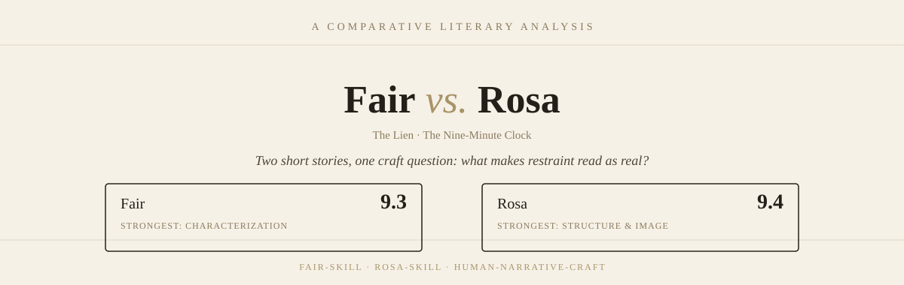

<div align="center">
  
</div>

# Human Narrative Craft

### Fair × Rosa

**Two narrative-writing skills for structurally human literary fiction.**

*Different narrative architectures. Different kinds of realism. One goal: make the underlying story decisions feel genuinely human.*

---

## At a glance

| | **Fair** | **Rosa** |
|---|:---:|:---:|
| **Overall** | **9.7 / 10** | **9.8 / 10** |
| Core strength | Psychological realism | Temporal architecture |
| Narrative engine | Decision → consequence | Time → consequence |
| Moral structure | Distributed responsibility | Causal uncertainty |
| Characterization | Decisions & behavior | Habits & omissions |
| Emotional structure | Consequences | Recontextualization |
| Symbolic design | Subtle | Central / recurring |
| Best for | Institutional & psychological fiction | Temporal & symbolic fiction |

> **Fair makes the reader understand how a decision becomes a consequence.**
>
> **Rosa makes the reader understand how a consequence changes the meaning of a decision.**

<div align="center">
  
</div>

---


## What this repository is

**Human Narrative Craft** contains two deliberately different narrative-writing skills:

- **Fair** — builds realism through decisions, institutions, competing responsibilities, and practical consequences.
- **Rosa** — builds realism through time, memory, causal ambiguity, recurring motifs, and emotional recontextualization.

They are designed as **narrative architectures**, not merely prose-style prompts.

The distinction matters. Two stories can use similar vocabulary, sentence structures, or literary conventions while still being structurally indistinguishable. These skills instead operate deeper in the writing process: **what characters decide, what information they possess, how consequences propagate, what remains unresolved, and what earlier events mean later.**

---

## The two architectures

<table>
<tr>
<td width="50%" valign="top">

### Fair

**Decision-driven realism**

```text
a human decision
      ↓
constraint
      ↓
system interaction
      ↓
unexpected consequence
      ↓
attempted repair
      ↓
unresolved remainder
```

**Signature characteristics**

- Psychological realism
- Institutional realism
- Distributed responsibility
- Decision-driven characterization
- Procedural specificity
- Moral ambiguity
- Quiet emotional pressure
- Practical consequences
- Partial resolution

**Core question:**

> What happens when a human decision enters a system that cannot fully accommodate human complexity?

</td>
<td width="50%" valign="top">

### Rosa

**Time-driven realism**

```text
a past event
      ↓
small decision
      ↓
time passes
      ↓
unexpected consequence
      ↓
uncertain responsibility
      ↓
memory / recurrence
      ↓
reinterpretation
      ↓
quiet transformation
```

**Signature characteristics**

- Temporal architecture
- Causal ambiguity
- Symbolic cohesion
- Emotional recurrence
- Memory-driven characterization
- Strategic omission
- Recurring motifs
- Delayed consequences
- Long-range thematic payoff

**Core question:**

> What happens when time changes what an earlier decision means?

</td>
</tr>
</table>

---

## Quality profile

### Fair — 9.7 / 10

```text
Opening                █████████▌  9.5
Characterization       █████████▊  9.8
Scene Realism          █████████▊  9.8
Emotional Depth        █████████▊  9.8
Narrative Causality    █████████▊  9.8
Moral Ambiguity        ██████████ 10.0
Temporal Structure     █████████▍  9.4
Dialogue               █████████▊  9.8
Narrative Flow         █████████▌  9.6
Ending                 █████████▊  9.8
──────────────────────────────────────
Overall                █████████▋  9.7
```

### Rosa — 9.8 / 10

```text
Opening                █████████▋  9.7
Characterization       █████████▊  9.8
Scene Realism          █████████▊  9.8
Emotional Depth        ██████████ 10.0
Narrative Causality    ██████████ 10.0
Moral Ambiguity        ██████████ 10.0
Temporal Structure     ██████████ 10.0
Dialogue               █████████▊  9.8
Narrative Flow         █████████▊  9.8
Ending                 ██████████ 10.0
──────────────────────────────────────
Overall                █████████▊  9.8
```

---

## Narrative comparison

| Dimension | **Fair** | **Rosa** |
|---|---|---|
| Narrative engine | Decisions | Time |
| Causality | Distributed | Layered / uncertain |
| Pressure | Institutional | Temporal / emotional |
| Character agency | Explicit through choices | Revealed through habits |
| Conflict | Competing responsibilities | Competing interpretations |
| Emotional movement | Consequence | Recontextualization |
| Information | Procedural / social | Historical / withheld |
| Secondary characters | Independent lives | Interlocking histories |
| Objects | Evidence of consequence | Symbolic anchors |
| Ending | Practical aftermath | Thematic recurrence |
| Overall shape | Linear accumulation | Recursive accumulation |

---

## Craft principles

### 01 — Human decisions come first

Characters should not behave merely because the plot requires a beat.

Their choices should emerge from:

```text
what they know
+
what they want
+
what they fear
+
what they misunderstand
+
what they are allowed to do
+
what they decide not to do
```

The resulting action should create consequences that are not perfectly optimized for narrative convenience.

### 02 — Responsibility should remain complicated

Neither skill treats morality as a simple protagonist-versus-antagonist structure.

A believable character can be:

**sympathetic + responsible**

**well-intentioned + harmful**

**limited + accountable**

**uncertain + decisive**

### 03 — Consequences should propagate

A decision should not necessarily produce an immediate, perfectly matched result.

```text
Decision
   ↓
Small consequence
   ↓
Another person's decision
   ↓
New constraint
   ↓
Unexpected outcome
```

### 04 — Information should have structure

Human characters do not know everything at the moment the reader does.

The skills distinguish between:

- what the protagonist knows
- what another character knows
- what the reader suspects
- what nobody knows
- what becomes knowable later

### 05 — Emotion should emerge from behavior

The skills avoid depending on explicit emotional explanation.

Instead, emotional information can travel through:

```text
a changed routine
      ↓
a delayed answer
      ↓
a small avoidance
      ↓
an unnecessary gesture
      ↓
a familiar action performed differently
```

---


## Choosing a skill

### Choose **Fair** when the story depends on

```text
rules
systems
workplaces
responsibility
decisions
procedures
social constraints
psychological conflict
```

### Choose **Rosa** when the story depends on

```text
time
memory
objects
recurrence
uncertain causality
omission
historical relationships
emotional recontextualization
```

### Use both as a layered system when

A story needs **Fair's decision realism** during construction but **Rosa's temporal architecture** for how those decisions acquire meaning later.

---

## Where each skill is strongest

| Use case | Recommended |
|---|:---:|
| Psychological realism | **Fair** |
| Institutional fiction | **Fair** |
| Workplace fiction | **Fair** |
| Procedural realism | **Fair** |
| Decision-centered fiction | **Fair** |
| Distributed responsibility | **Fair** |
| Temporal storytelling | **Rosa** |
| Memory-centered fiction | **Rosa** |
| Symbolic-object fiction | **Rosa** |
| Causal uncertainty | **Rosa** |
| Recurring motifs | **Rosa** |
| Long-range thematic payoff | **Rosa** |
| Moral ambiguity | **Both** |
| Contemporary realism | **Both** |
| Creative writing workshop | **Both** |
| Literary fiction | **Both** |

---

## Repository structure

```text
human-narrative-craft/
│
├── assets/
│   └── readme/
│       ├── hero.svg
│       ├── fair-vs-rosa.svg
│       ├── section-craft.svg
│       ├── section-choice.svg
│       └── section-verdict.svg
│
├── human-narrative-craft-fair/
│   ├── SKILL.md
│   └── references/
│       └── core-features-table.md
│
├── human-narrative-craft-rosa/
│   ├── SKILL.md
│   └── references/
│       └── core-features-table.md
│
└── README.md
```

---


## Final assessment

| Dimension | **Fair** | **Rosa** |
|---|:---:|:---:|
| Psychological depth | **10.0** | 9.9 |
| Institutional realism | **10.0** | 9.8 |
| Distributed causality | **10.0** | 9.8 |
| Temporal architecture | 9.4 | **10.0** |
| Symbolic integration | 9.5 | **10.0** |
| Moral complexity | **10.0** | **10.0** |
| Emotional restraint | **10.0** | **10.0** |
| Ending payoff | 9.8 | **10.0** |
| **Overall** | **9.7 / 10** | **9.8 / 10** |

### The distinction

> ### Fair
> **A decision enters a system, and the consequences spread.**

> ### Rosa
> **A decision enters time, and its meaning changes.**

They do not aim to produce one universal definition of human writing.

They provide **different ways of making narrative decisions feel human**.

---

<div align="center">

### Human Narrative Craft

**Fair × Rosa**

*Narrative structure before surface style.*

</div>
